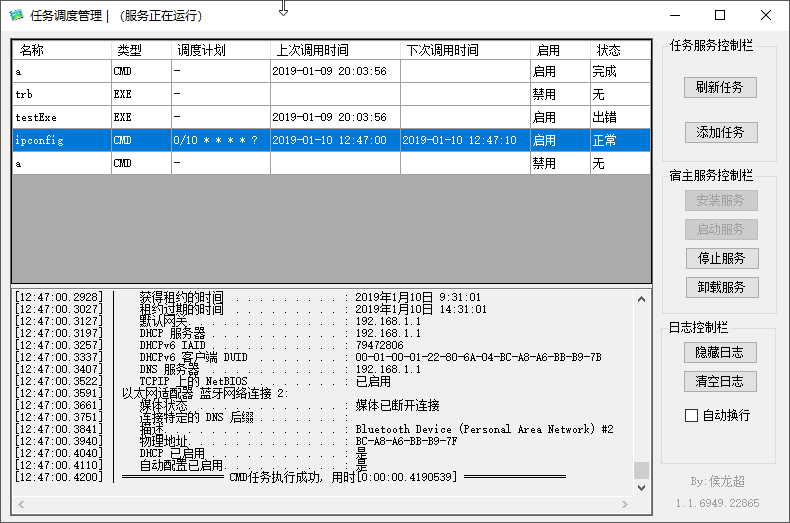
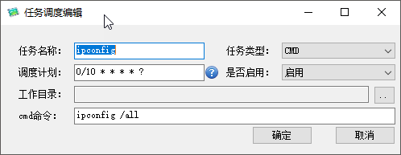
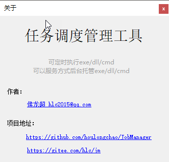

# 任务调度管理平台

**可定时执行exe/dll/cmd**
**可以服务方式后台托管exe/dll/cmd**

## 程序功能

程序包含一个`宿主服务`，可以在`宿主服务控制栏`中进行管理。

所有`任务服务`都是通过`宿主服务`运行，`任务服务`可以在`任务服务控制栏`和任务服务列表中任务项上鼠标右键进行管理。

`宿主服务`或`任务服务`运行起来后该任务调度管理控制界面就可以关闭，不影响后台服务。

## 程序截图

